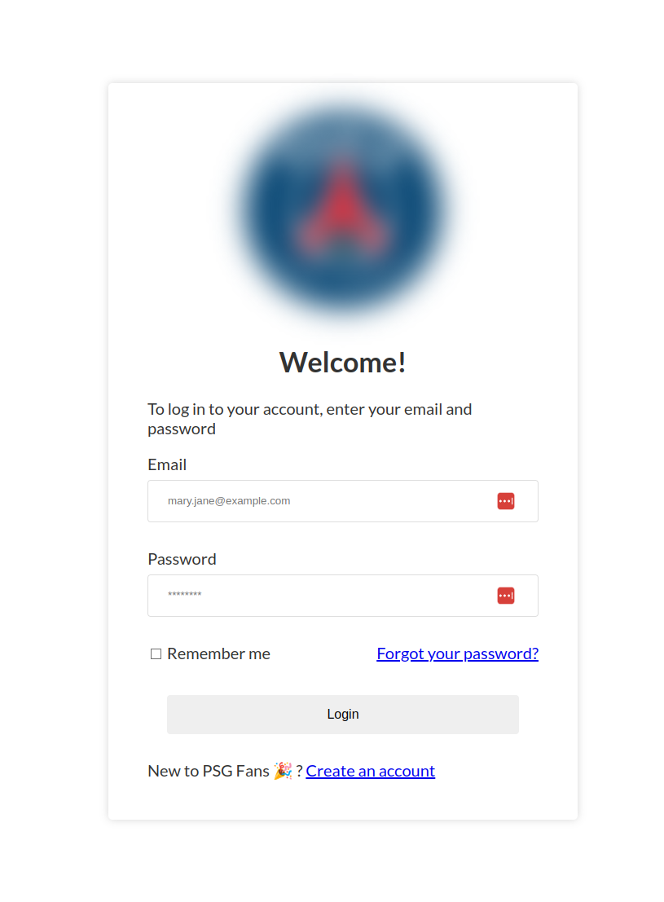

# Nuxt authentication module for Atlas App Services

This Nuxt module contains basic email/password authentication component integrated with [MongoDB Atlas App Services Authentication](https://www.mongodb.com/docs/atlas/app-services/users/), as a result you will get 
Atlas access token to authorize to Atlas services. It also has a built-in middleware for route protection and composable for automatic token refreshment. This module is useful when you are building backoffice apps using MongoDB as a data layer. You have to remember that it requires to configure Atlas app before 
using this module. To see examples check the `playground` directory.


## Overview

Here is preview you can easily customize the look using named slots `#logo` and `#title` (example shown below).




### How to use

Configuration `nuxt.config.ts` provide your Atlas App ID

```js

mongoAtlasLogin: {
    // atlas app id
    appId: '...'   
  }

```

To render authentication component just use `atlas-login-component`as show below.

```html
<atlas-login-component
  @signed-in="onSignedIn"
  @signed-up="onSignedUp"
  @reset="onReset"
>
  <!-- logo slot -->
  <template #logo>
    <nuxt-img src="https://upload.wikimedia.org/wikipedia/en/a/a7/Paris_Saint-Germain_F.C..svg" />
  </template>
  <!-- title slot -->
  <template #title>
    <h3 class="title">
      Welcome!
    </h3>
    <p>To log in to your account, enter your email and password</p>
  </template>
</atlas-login-component>
```

You can also listen for 3 events emitted from component on different occasions `signed-in` , `signed-up` , `reset`. To route user to specific page after successful login

```js

async function onSignedIn(_session: AtlasSession) {
  navigateTo('/user-profile');
}

```

This module contains built-in authorization middleware to protect specific pages against shady actors.

```js
definePageMeta({
  middleware: ['auth'],
});
```

To get current access token use `useAtlasSession` composable.

```js
const { getAccessToken } = useAuthStore();
```

For more details check `playground` directory.


